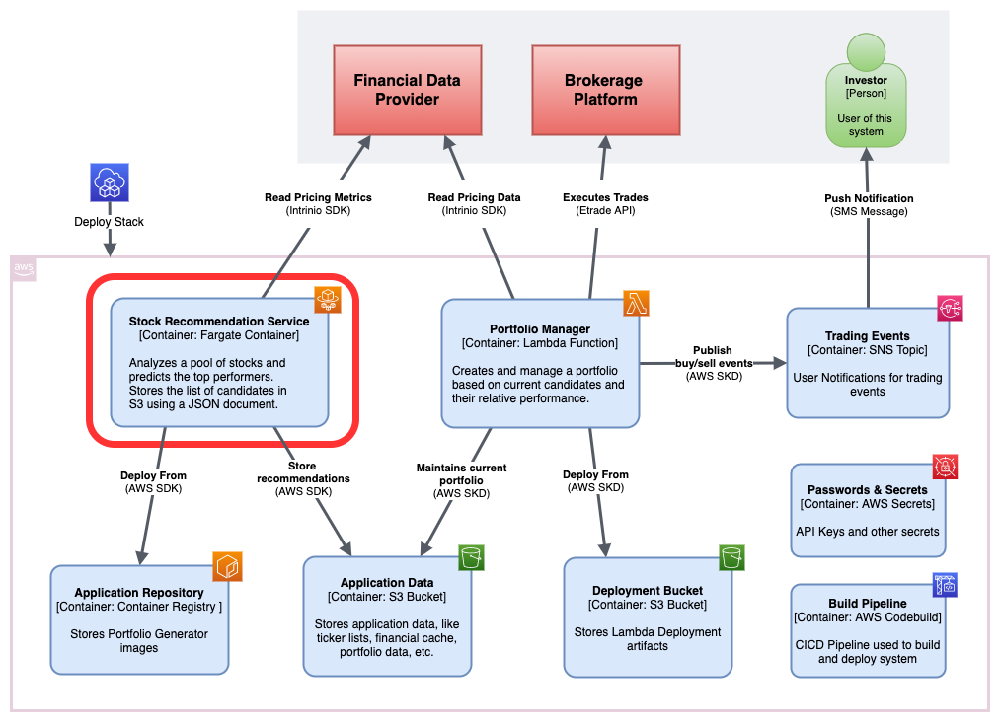

# Overview


The stock recommendation service is a component of the Stock Advisor system that generates stock (US Equities) recommendations depending on the level of analyst target price agreement. It is based on the findings of paper like these:

|Paper|Author(s)|
|--|--|
|[Consensus Analyst Target Prices: Information Content and Implications for Investors](doc/Consensus-Analyst-Target-Prices.pdf)|Asa B. Palley, Thomas D. Steffen, X. Frank Zhang|
|[Dispersion in Analysts’ Target Prices and Stock Returns](doc/Dispersion-Analysts-Target-Prices-Stock-Returns.pdf)|Hongrui Feng Shu Yan|
|[The predictive power of analyst price target and its dispersion](doc/Predictive-Power-Analyst-Price-Target-Dispersion.pdf)|Heng(Emily) Wang, Shu Yan|

They suggest, among other things, that when taken individually or even on average, analyst price targets are not a good predictor of returns, but relative agreement or disagreement is.

This repo is part of the Stock Advisor project found here:

https://github.com/hanegraaff/stock-advisor-main-project

## Algorithm Description
After reading a list of ticker symbols, the algorithm ranks them into deciles, with the lowest decile containing stocks with the highest level of analyst price agreement, and the highest decile containing stocks with the lowest price agreement. 

Next, the steps are outlined

1) Download financial data for each symbol:
    - Current Price
    - Analyst price forecast average
    - Analyst price forecast standard deviation
2) Convert the standard deviation into a percentage from the mean.
3) Rank the portfolio by this percentage and sort into deciles.
4) Select a portfolio from the last decile. This will return stocks with the largest level of disagreement.

## Financial Data
This program relies on financial data to perform its calculations, specifically it requires current and historical pricing information as well as analyst target price predictions. This data is sourced from Intrinio, though other providers could be used.

Intrinio offers free access to their sandbox, which gives developers access to a limited dataset comprising of roughly 30 stocks. The results presented here are based on that. A paid subscription would allow access to a much larger universe of stocks.


## Release Notes (v0.6)
This is an early version with limited functionality.

* Generate portfolio recommendation given a list of ticker symbols.
* Local caching of financial data
* Back testing capability
* Dockerized application
* Integrate into Stock Advisor Infrastructure

## Prerequisites
### API Keys
An API Key for the Intrinio (https://www.intrinio.com) with access to the "US Fundamentals and Stock Prices" and "Zacks Price Targets" feeds

the API must be saved to the environment like so:

```export INTRINIO_API_KEY=[your API key]```

### Installation requirements
```pip install -r requirements.txt```

You may run this in a virtual environment like so:

```
python3 -m venv venv
source venv/bin/activate

cd src
pip install -r requirements.txt
```

## Running the service from the command line
All scripts must be executed from the ```src``` folder.

```
src >>python stock_recommendation_svc.py -h
usage: stock_recommendation_svc.py [-h] -ticker_file TICKER_FILE
                                   -portfolio_size PORTFOLIO_SIZE
                                   {test,production} ...

Reads a list of US Equity ticker symbols and recommends a subset of them based
on the degree of analyst target price agreement, specifically it will select
stocks with the lowest agreement and highest predicted return. The input
parameters are a file containing a list of of ticker symbols, the month and
year period for the recommendations, a current price date used to compute
actual returns, and size of the final recommendation. The output is a JSON
data structure with the final selection. When running this script in
"production" mode, the analysis period is determined at runtime, and inputs,
like the ticker file are downloaded from S3.

optional arguments:
  -h, --help            show this help message and exit
  -ticker_file TICKER_FILE
                        Ticker Symbol local file path
  -portfolio_size PORTFOLIO_SIZE
                        Selected Portfolio Size

environment:
  runtime environment

  {test,production}     the runtime environment of the application. It can be
                        either "test" or "production"
    test                Test mode. Analysis period and current date must be
                        passed explicitly
    production          Production mode. Analysis period and current date are
                        determined at runtime
```

Where ```-ticker_file``` represents a local file or s3 object used to represent the universe of stocks that will be considered. It must contain
a single ticker symbol per line.

```
AAPL
AXP
BA
CAT
CSCO
CVX
...
```

and ```-portfolio_size``` represents the the total number of recommended
stocks resulting from the analysis

The script can be run in two modes, representing different runtime environments.

### Production mode
**Production** mode will automatically determine the analysis period and current price date based on the calendar date. It will also use s3 to read some of its inputs, and store final results. This is the mode that must be used when running in ECS.

```
src >>python stock_recommendation_svc.py production -h
usage: stock_recommendation_svc.py production [-h] -app_namespace
                                            APP_NAMESPACE

optional arguments:
-h, --help            show this help message and exit
-app_namespace APP_NAMESPACE
                        Application namespace used to identify AWS resources
```

For example:
```
python stock_recommendation_svc.py -ticker_file djia30.txt -portfolio_size 3 production -app_namespace sa
```

This example generates a 3 stock recommendation using the DOW 30 as an input. The namespace is used to identify the appropriate resources exposed by CloudFormation exports, e.g. the S3 bucket where results will be published.

### Test mode
**Test** mode will expect all parameters to be supplied in the command line, and will source the input ticker file locally. This mode is used when running and testing outside the production environment, and may also be used to run historically
    
```
src >>python stock_recommendation_svc.py test -h
usage: stock_recommendation_svc.py test [-h] -analysis_month ANALYSIS_MONTH
                                        -analysis_year ANALYSIS_YEAR
                                        -price_date PRICE_DATE

optional arguments:
-h, --help            show this help message and exit
-analysis_month ANALYSIS_MONTH
                        Analysis period's month
-analysis_year ANALYSIS_YEAR
                        Analysis period's year
-price_date PRICE_DATE
                        Current Price Date (YYYY/MM/DD)
```

For example:
```
python stock_recommendation_svc.py -ticker_file djia30.txt -portfolio_size 3 test -analysis_year 2020 -analysis_month 1 -price_date 2020/03/01 
```

This will generate a 3 stock recommendation using a local ticker file of the DOW 30 using an analysis period of 01/2020 and a price date of 03/01

```analysis_year``` / ```analysis_month``` represent the financial period of the analyst forecasts, and ```price_date``` is the price date used to calculate the portfolio's current returns.


## Running the service as a docker image
It is possible to package the application as a Docker image. To build the container, run the following script:

```
>>./docker_build.sh
Sending build context to Docker daemon    126MB
Step 1/6 : FROM python:3.8-slim-buster
 ---> ee07b1466448
Step 2/6 : LABEL maintainer hanegraaff@gmail.com
 ---> Running in a684be7d3a89
Removing intermediate container a684be7d3a89
 ---> fa1bfe7dedbb
Step 3/6 : COPY ./src /app
 ---> 2b4972cee31b
Step 4/6 : WORKDIR /app
 ---> Running in cc780c1aca64
Removing intermediate container cc780c1aca64
 ---> 2c9d26ea0a28
Step 5/6 : RUN pip install -r requirements.txt
 ---> Running in 8e6d18a64ef7
...
Removing intermediate container 8e6d18a64ef7
 ---> b166ecddc400
Step 6/6 : ENTRYPOINT ["python", "recommendation_svc.py"]
 ---> Running in 3963296f1b3f
Removing intermediate container 3963296f1b3f
 ---> f1a79df20439
Successfully built f1a79df20439
Successfully tagged stock-advisor/recommendation_svc:v1.0.0
```
The resulting image will look like this:
```
>>docker images
REPOSITORY                         TAG                 IMAGE ID            CREATED             SIZE
stock-advisor/generate-portfolio   v1.0.0              f1a79df20439        9 hours ago         376MB
python                             3.8-slim-buster     ee07b1466448        7 days ago          193MB
```

Once built, the container is executed in a similar way as the script. Note how the ```INTRINIO_API_KEY``` must be supplied as a special environment variable. AWS credentials must also be supplied externally

For example:

```
docker run -e INTRINIO_API_KEY=xxx -e BOTO_CONFIG=us-east-1 image-id -ticker_file djia30.txt -portfolio_size 3 production -app_namespace sa
```

## Running the service in ECS
This service is intended to be run in ECS using a fargate task. The automation contained in the (Stock Advisor) main project will make available the ECS Cluster, task definition, Container Repositry and CodeBuild project needed to build and deploy the service to AWS.

More documentation will follow

## Output

The main output is a JSON Document with the portfolio recommendation.

```
[INFO] - 
[INFO] - Recommended Portfolio
[INFO] - {
    "portfolio_id": "1430b59a-5b79-11ea-8e96-acbc329ef75f",
    "creation_date": "2020-03-01T04:56:57.612693+00:00",
    "data_date": "2019-08-31T00:00:00",
    "strategy_name": "PRICE_DISPERSION",
    "portfolio": [
        "GE",
        "INTC",
        "AAPL"
    ]
}
```
Additionally, the program will display a Pandas Data Frame containing the ranked stocks used to select the final portfolio, and an indication of its relative performance compared to the average of all all supplied stocks.
```
[INFO] - 
[INFO] - Recommended Portfolio Return: 19.49%
[INFO] - Average Return: 4.77%
[INFO] - 
[INFO] - Analysis Period - 8/2019, Actual Returns as of: 2019/10/30
analysis_period ticker  dispersion_stdev_pct  analyst_expected_return  actual_return  decile
         2019-8     GE                30.652                    0.470          0.225       9
         2019-8   INTC                15.420                    0.136          0.194       9
         2019-8   AAPL                14.518                    0.063          0.165       9
         2019-8    UTX                13.414                    0.191          0.104       8
         2019-8    MMM                12.581                    0.116          0.041       8
         2019-8     PG                13.586                   -0.050          0.039       8
         2019-8    PFE                12.527                    0.246          0.082       7
         2019-8     GS                11.635                    0.223          0.058       7
         2019-8    CAT                10.072                    0.220          0.179       6
         2019-8     BA                 9.590                    0.184         -0.050       6
         2019-8   MSFT                10.812                    0.093          0.049       6
         2019-8    XOM                 8.444                    0.222         -0.011       5
         2019-8    NKE                 9.515                    0.102          0.067       5
         2019-8    UNH                 7.894                    0.248          0.089       4
         2019-8   CSCO                 8.093                    0.218          0.016       4
         2019-8    WMT                 8.045                   -0.007          0.034       4
         2019-8    IBM                 7.586                    0.157         -0.002       3
         2019-8    AXP                 7.826                    0.094         -0.019       3
         2019-8    MCD                 7.857                    0.021         -0.097       3
         2019-8    MRK                 7.522                    0.040         -0.003       2
         2019-8    TRV                 7.433                    0.038         -0.117       2
         2019-8    JPM                 7.262                    0.113          0.144       1
         2019-8     VZ                 6.668                    0.043          0.046       1
         2019-8     HD                 6.855                   -0.051          0.037       1
         2019-8    CVX                 5.515                    0.171         -0.012       0
         2019-8    JNJ                 5.205                    0.160          0.035       0
         2019-8      V                 5.398                    0.095         -0.009       0
```

The ```dispersion_stdev_pct``` column represents the degree of analyst agreement, lower values indicate higher agreement, and is expressed as as the standard deviation percentage (from the mean).

The ```decile``` column shows the relative ranking for this ticker.

## Backtesting

It is possible to backtest this strategy by running the ```price_dispersion_backtest.py``` script. It works by running the strategy from 05/2019 to 11/2019 and comparing the returns of the selected portfolio with the average of the list supplied to it.

Example:

```python price_dispersion_backtest.py -ticker-file ticker-list.txt -portfolio-size 3```

```
investment_period  ticker_sample_size  avg_ret_1M  sel_ret_1M  avg_ret_2M  sel_ret_2M  avg_ret_3M  sel_ret_3M
          2019/05                  12       8.09%       9.95%      11.17%      12.31%       8.74%       5.49%
          2019/06                  27       2.41%       3.56%      -1.95%     -10.78%       0.54%      -4.30%
          2019/07                  27      -3.08%      -9.93%      -0.92%      -3.65%       0.17%       1.51%
          2019/08                  27       2.85%       8.12%       4.77%      19.49%       7.34%      29.03%
          2019/09                  23       2.26%       9.60%       4.80%      17.53%       8.21%      21.29%
          2019/10                  28       2.67%       5.34%       4.99%       5.97%       6.43%      14.98%
          2019/11                  26       2.26%       0.68%       3.53%       8.88%      -8.55%      -7.02%
investment_period ticker_sample_size  avg_tot_1M  sel_tot_1M  avg_tot_2M  sel_tot_2M  avg_tot_3M  sel_tot_3M
          ----/--                 --      17.45%      27.30%      26.39%      49.74%      22.89%      60.98%
```

Each line reports the returns for each montly portfolio selection at a 1 month, 2 month and 3 month horizon.

## Caching of financial data
All financial data is saved to a local cache to reduce reliance on the Intrinio API. As of this version the data is set to never expire, and the cache will grow to a maximum size of 4GB.

The cache is located in the following path:

```
./financial-data/
./financial-data/cache.db
```

To delete or reset the contents of the cache, simply delete entire ```./financial-data/``` folder

## Unit testing
You may run all unit tests using this command:

```./test.sh```

This command will execute all unit tests and run the coverage report (using coverage.py)

```
src >>./test.sh
..................................................................
----------------------------------------------------------------------
Ran 66 tests in 0.059s

OK
Name                                      Stmts   Miss  Cover
-------------------------------------------------------------
cloud/aws_service_wrapper.py                 38      8    79%
data_provider/intrinio_data.py              142     47    67%
data_provider/intrinio_util.py               27      0   100%
exception/exceptions.py                      30      1    97%
model/ticker_file.py                         50     10    80%
service_support/recommendation_svc.py        20      0   100%
strategies/calculator.py                     19      0   100%
strategies/portfolio.py                      29      0   100%
strategies/price_dispersion_strategy.py      65     26    60%
support/constants.py                          8      0   100%
support/financial_cache.py                   33      2    94%
support/util.py                              11      1    91%
-------------------------------------------------------------
TOTAL                                       472     95    80%
```
