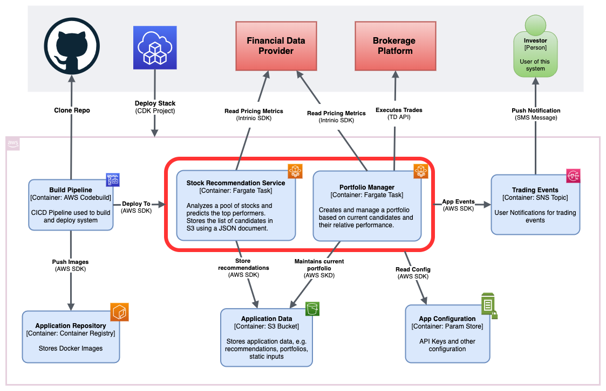
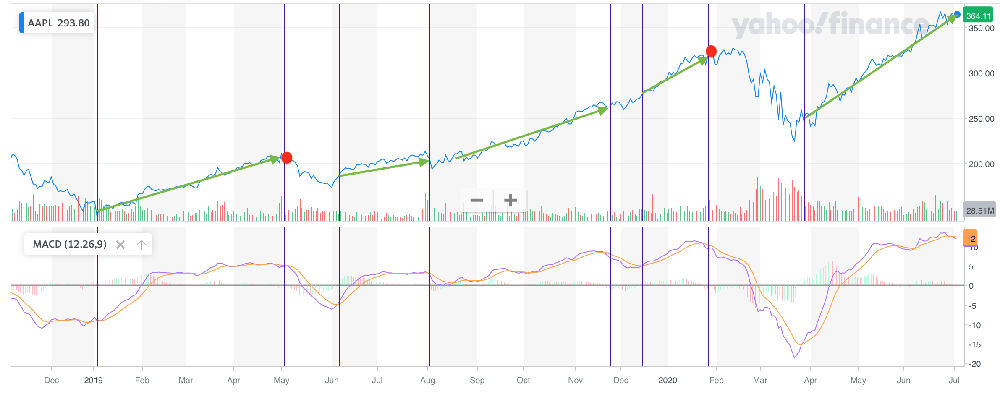
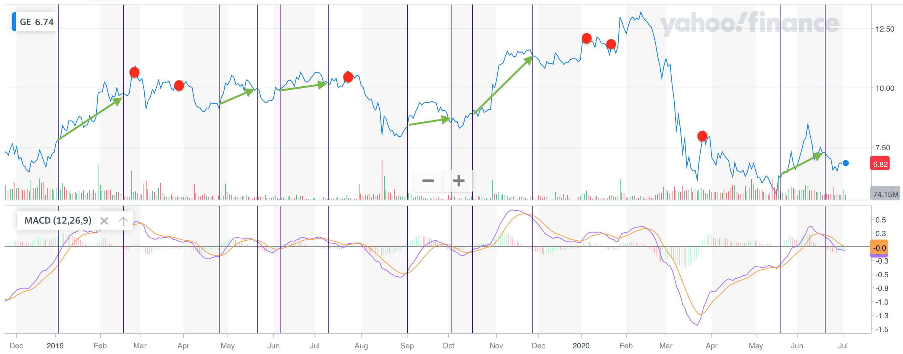
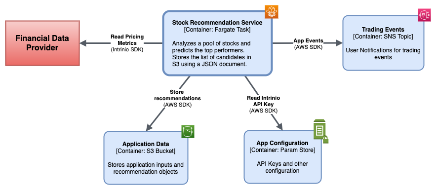
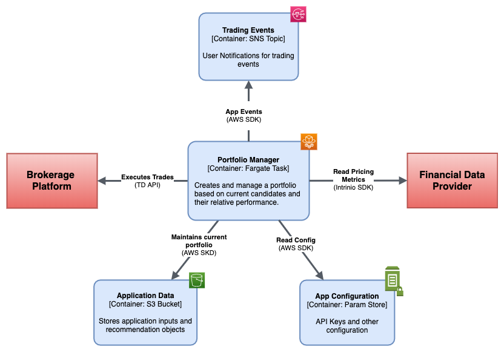

# Overview


This repo is part of the Stock Advisor project found here:

https://github.com/hanegraaff/stock-advisor-infrastructure

This project contains the Stock Advisor application software. It is organized into two services that run as docker images. The first is a recommendation service that generates predictions based on various trading strategies, and the second is a portfolio manager that executes trades based on those same predictions.


# Table of Contents
* [Financial Brokerage and Data](#financial-brokerage-and-data)
* [Prerequisites](#prerequisites)
    * [Authentication Keys](#authentication-keys)
        * [Intrinio API Key](#intrinio-api-key)
        * [TDAmeritrade Keys](#tdameritrade-keys)
    * [Develpment Environment](#develpment-environment)
* [Trading Strategies](#trading-strategies)
    * [Price Dispersion Strategy](#price-dispersion-strategy)
        * [Backtest](#price-dispersion-backtest)
    * [MACD Crossover Strategy](#macd-crossover-strategy)
        * [Backtest](#macd-crossover-backtest)
* [Securities Recommendation Service](#securities-recommendation-service)
    * [Running the service from the command line](#running-the-service-from-the-command-line)
    * [Output](#recommendation-service-output)
    * [Caching of financial data](#caching-of-financial-data)
    * [Backtesting](#backtesting)
* [Portfolio Manager](#portfolio-manager)
    * [Trading Strategy](#trading-strategy)
    * [Running the service from the command line](#running-the-portfolio-manager-from-the-command-line)
    * [Output](#portfolio-manager-output)
* [Notifications](#notifications)
* [Running the services](#running-the-services)
    * [Running the service as a docker image](#running-the-service-as-a-docker-image)
    * [Running the service in ECS](#running-the-service-in-ECS)
* [Unit Testing](#unit-testing)

# Financial Brokerage and Data
This software relies on a range of financial data to perform its calculations. As of this version, data is sourced from Intrinio, though other providers may be supported in the future.

Intrinio offers free access to their sandbox, which gives developers access to a limited dataset comprising of the DOW30, and the results presented here are based on that list. A paid subscription allows access to a much larger universe of stocks.

This software also has the ability to trade automatically and requires access to a personal TD Ameritrade brokerage account. Once configured, it will use the cash available in the account to maintain an evolving portfolio based on the latest recommendations.

# Prerequisites
1) Python 3.8
2) Intrinio API Key
3) Access to a TDAmeritrade brokerage account
4) Access to AWS account.

## Authentication Keys
All authentication keys are stored as environment variables. When running locally these
must be exported to the environment, and when running on ECS they are sourced directly
from the parameter store and fed to the container environment. This section describes the process of exporting keys locally.

### Intrinio API Key
You will need to set up an Intrinio API Key (https://www.intrinio.com) with access to the "US Fundamentals and Stock Prices" and "Zacks Price Targets" feeds.

the API must be saved to the environment like so:

```export INTRINIO_API_KEY=[your API key]```

### TDAmeritrade Keys
Additionally, you will need to authenticate with TDAmeritrade in order to buy and sell securities. This software will treat the account as its own, meaning that any
positions that are not part of its portfolio, will be unwound. Specifically, it will
execute trades in a way that positions will always match those in the recommended portfolio.

TDAmeritrade uses OAuth for authentication, and the initial setup process is described
here:

https://github.com/hanegraaff/TDAmeritrade-api-authentication

As of this version you must manually create an authorization code and an initial refresh token that will be valid for 3 months, after which the process must be repeated.

Once you generate these artifacts, you must save them in the environment like this:

```
export TDAMERITRADE_ACCOUNT_ID=[your TDAmeritrade Account ID]
export TDAMERITRADE_CLIENT_ID=[your TDAmeritrade Client ID/Consumer Key]
export TDAMERITRADE_REFRESH_TOKEN=[your TDAmeritrade refresh token]
```

## Development Environment
```pip install -r requirements.txt```

It is highly recommended to run this in a virtual environment:

```
python3 -m venv venv
source venv/bin/activate

cd src
pip install -r requirements.txt
```
Be sure that ```python3``` points to Python 3.8. Alternatively you can create the virtual environment this way:

```
python3.8 -m venv venv
...
```

All scripts must be executed from the ```src``` folder.

# Trading Strategies
All recommendations produced by the Securities Recommendation Service are created using Trading Strategies which are located in the ```strategies``` module of this software. A strategy is simply an algorithm that reads a list of securities (currently US Equities), downloads all necessary financial data and either ranks or filters them to produce a subset that is predicted to outperform their peers based on the algorithm's calculations. 

All strategies are implemented as classes that derive from the ```BaseStrategy``` Abstract Base Class, and expose a consistent interface. Each is self contained in the sense that it must be able to initialize using a configuration file stored either locally or in S3, the latter being how strategies are initialized in production. They can also be initialized using a constructor, a technique which is useful when backtesting or performing other types of tests.

The main input to a Trading Strategy is a list of ticker symbols used a basis for the analysis and as of this version, all available strategies are based on US Equities.

Each list is represented using a ```TickerList``` object and persisted using a JSON document and like other inputs, they may be sourced locally or from S3.

Here is an example of a (trimmed) list representing the DOW30.

```JSON
{
	"list_name": "DOW30",
	"list_type": "US_EQUITIES",
	"comparison_symbol": "DIA",
	"ticker_symbols":[
		"AAPL",
		"AXP",
		"BA",
		"CAT",
		"CSCO",
		"CVX",
		"GE",
		"GS",
		"HD",
		"IBM",
		"INTC",
		"..."
	]
}
```

When running in production, inputs are defined in a configuration file and are supplied to a strategy during initialization. This configuration identifies the appropriate ticker list and defines other static parameters used by the strategy.

Here is an example section for the Price Dispersion strategy:

```ini
[price_dispersion_strategy]
ticker_list_file_name=djia30.json
output_size=3
```

Next, is an example of a strategy that is initialized using configuration. The application namespace is used to identify the S3 bucket used to store inputs. All inputs can be soured locally or from S3. In fact if an input is sourced from S3 and is not found, this software will look for a suitable local alternative and stage it to S3. This is done to simplify the preparation work when new strategies are introduced.

```python
from support import constants
from support.configuration import Configuration

app_namespae = 'sa'

config = Configuration.try_from_s3(
    constants.STRATEGY_CONFIG_FILE_NAME, app_namespae)
pd_strategy = PriceDispersionStrategy.from_configuration(config, app_namespae)
```

Alternatively, strategies can be initialized using a plain constructor. The two methods are functionally equivalent.

```python
from model.ticker_list import TickerList

ticker_list = TickerList.from_local_file(
            "%s/djia30.json" % (constants.APP_DATA_DIR))

pd_strategy = PriceDispersionStrategy(
            ticker_list, '2020-06', date(2020, 2, 22), 3)
```

The output of a strategy is a RecommendationSet object which contains the list of recommended securities and a date range indicating its valid duration. Each strategy is different, and some will produce recommendations that can change daily (e.g. MACD crossover strategy) while others will last much longer (e.g. Price Dispersion Strategy)

Once a strategy is initialized, it can be executed like this. the ```display_results``` method display all intermediate data and final results to the screen, and is optional.

```python
pd_strategy.generate_recommendation()
pd_strategy.display_results()

# this is the final recommendation
recommendation_set = pd_strategy.recommendation_set
```

And here is what the recommendation will look like:

```JSON
{
    "set_id": "5d6c5a42-b54d-11ea-a412-acbc329ef75f",
    "creation_date": "2020-06-23T12:30:47.271203+00:00",
    "valid_from": "2020-06-01",
    "valid_to": "2020-06-30",
    "price_date": "2020-05-31",
    "strategy_name": "PRICE_DISPERSION",
    "security_type": "US Equities",
    "securities_set": [
        {
            "ticker_symbol": "BA",
            "price": 145.85
        },
        {
            "ticker_symbol": "GE",
            "price": 6.57
        },
        {
            "ticker_symbol": "XOM",
            "price": 45.47
        }
    ]
}

```

## Price Dispersion Strategy
This strategy generates monthly US Equities recommendations using a market sentiment algorithm that ranks stocks based on the level of analyst target price agreement, and is based on the findings of paper like these:

|Paper|Author(s)|
|--|--|
|[Consensus Analyst Target Prices: Information Content and Implications for Investors](doc/Consensus-Analyst-Target-Prices.pdf)|Asa B. Palley, Thomas D. Steffen, X. Frank Zhang|
|[Dispersion in Analysts’ Target Prices and Stock Returns](doc/Dispersion-Analysts-Target-Prices-Stock-Returns.pdf)|Hongrui Feng Shu Yan|
|[The predictive power of analyst price target and its dispersion](doc/Predictive-Power-Analyst-Price-Target-Dispersion.pdf)|Heng(Emily) Wang, Shu Yan|

They suggest, among other things, that when taken individually or even on average, analyst price targets are not a good predictor of returns, but the degree of agreement/disagreement is.

The strategy is designed to run once per month once all price forecasts are available; analysts typically update their forecasts on a monthly basis. Recommendations that result from this strategy are valid for the entire calendar month and are only updated at the beginning of following month.

### Algorithm
1) For each ticker symbol in the securities list, download:
    - Current Price
    - Analyst price forecast average
    - Analyst price forecast standard deviation
    - Analyst price forecast count (i.e. total forecasts)
2) Normalize the standard deviation by converting it into a percentage relative to the price.
3) Load data into a Pandas DataFrame, rank it by this percentage and sort into deciles. Sort each decile by expected return.
4) Select a subset from the top decile(s). This will return stocks with the largest level of disagreement.
5) ???
6) Profit!

### Output
The following is the output that is displayed when the ```display_results()``` method is called.

```
[INFO] - Recommended Securities
[INFO] - {
    "set_id": "5d6c5a42-b54d-11ea-a412-acbc329ef75f",
    "creation_date": "2020-06-23T12:30:47.271203+00:00",
    "valid_from": "2020-06-01",
    "valid_to": "2020-06-30",
    "price_date": "2020-05-31",
    "strategy_name": "PRICE_DISPERSION",
    "security_type": "US Equities",
    "securities_set": [
        {
            "ticker_symbol": "BA",
            "price": 145.85
        },
        {
            "ticker_symbol": "GE",
            "price": 6.57
        },
        {
            "ticker_symbol": "XOM",
            "price": 45.47
        }
    ]
}
[INFO] - 
[INFO] - Recommended Securities Return: 12.83%
[INFO] - Average Return: 1.64%
[INFO] - 
[INFO] - Analysis Period - 2020-05, Actual Returns as of: 2020-06-22
analysis_period ticker  dispersion_stdev_pct  analyst_expected_return  actual_return  decile
        2020-05     BA                36.051                    0.445          0.293       9
        2020-05     GE                28.961                    0.355          0.072       9
        2020-05    XOM                26.059                    0.133          0.021       9
        2020-05     GS                19.965                    0.088          0.035       8
        2020-05    CAT                20.156                    0.040          0.047       8
        2020-05    CVX                15.403                    0.143         -0.001       7
        2020-05    PFE                15.243                    0.090         -0.133       7
        2020-05    NKE                15.452                    0.016          0.009       7
        2020-05    TRV                14.848                    0.156          0.086       6
        2020-05   INTC                15.180                    0.011         -0.045       6
        2020-05     KO                10.536                    0.141         -0.020       5
        2020-05    IBM                10.480                    0.063         -0.031       5
        2020-05   AAPL                13.330                    0.004          0.129       5
        2020-05    AXP                10.080                    0.107          0.046       4
        2020-05   CSCO                 9.905                    0.022         -0.056       4
        2020-05    MCD                 9.181                    0.088          0.006       3
        2020-05    UNH                 8.997                    0.050         -0.040       3
        2020-05    MMM                 9.620                    0.011          0.002       3
        2020-05    WMT                 8.167                    0.070         -0.019       2
        2020-05   MSFT                 8.276                    0.062          0.095       2
        2020-05    JPM                 8.048                    0.083         -0.006       1
        2020-05      V                 8.077                    0.028         -0.001       1
        2020-05     HD                 7.568                   -0.047          0.003       1
        2020-05    MRK                 6.081                    0.157         -0.049       0
        2020-05     PG                 6.668                    0.132          0.016       0
        2020-05     VZ                 5.883                    0.073         -0.030       0
```

### Price Dispersion Backtest
It is possible to backtest this strategy by running the ```price_dispersion_backtest.py``` script. It works by running the strategy from 05/2019 to 02/2020 and comparing the returns of the selected portfolio with the average of the list supplied to it.

Example:

```
>>python price_dispersion_backtest.py -ticker_file djia30.txt -output_size 3
[INFO] - Parameters:
[INFO] - Ticker File: djia30.txt
[INFO] - Output Size: 3
[INFO] - Performing backtest for 5/2019
[INFO] - Performing backtest for 6/2019
[INFO] - Performing backtest for 7/2019
[INFO] - Performing backtest for 8/2019
[INFO] - Performing backtest for 9/2019
[INFO] - Performing backtest for 10/2019
[INFO] - Performing backtest for 11/2019
[INFO] - Performing backtest for 12/2019
[INFO] - Performing backtest for 1/2020
[INFO] - Performing backtest for 2/2020
investment_period  ticker_sample_size  avg_ret_1M  sel_ret_1M  avg_ret_2M  sel_ret_2M  avg_ret_3M  sel_ret_3M
          2019/05                  12       8.09%       9.95%      11.17%      12.31%       8.74%       5.49%
          2019/06                  26       2.35%       3.56%      -2.00%     -10.78%       0.38%      -4.30%
          2019/07                  26      -3.10%     -11.72%      -1.03%      -5.64%      -0.07%      -3.24%
          2019/08                  26       2.78%       8.12%       4.55%      19.49%       7.09%      29.03%
          2019/09                  22       2.12%       9.60%       4.62%      17.53%       8.13%      21.29%
          2019/10                  27       2.65%       5.34%       5.01%       5.97%       6.43%      14.98%
          2019/11                  26       2.26%       0.68%       3.53%       8.88%      -8.55%      -7.02%
          2019/12                  25       1.46%       5.60%     -10.80%      -8.54%     -19.59%     -20.31%
          2020/01                  27     -10.03%     -10.39%     -20.47%     -21.08%     -12.65%     -20.99%
investment_period ticker_sample_size  avg_tot_1M  sel_tot_1M  avg_tot_2M  sel_tot_2M  avg_tot_3M  sel_tot_3M
          ----/--                 --       8.57%      20.71%      -5.42%      18.14%     -10.09%      14.93%
```

Each line reports the returns for each monthly portfolio selection at a 1 month, 2 month and 3 month horizon.

## MACD Crossover Strategy
This is a momentum based strategy that will determine which securities in the ticker list are in a bullish pattern. Bullish stocks are included in the recommendation and indicate a buy signal, while bearish stocks are excluded, and indicate a sell.

Momentum is measured by looking at the MACD oscillator, where bullish stocks are identified when the MACD is negative and the histogram is approaching 0 and remains so until the MACD is positive, but the histogram has dipped significantly in negative territory. The latter is measured by dividing the histogram by the price and comparing it to a threshold supplied to the strategy.

### Algorithm
1) For each security in the ticker list download Current Price and MACD Data.
2) Measure whether the divergence is significant:
```
    s = abs(histogram / price) > threshdold
```
3) Check for the following:
```
    if macd > 0 and histogram > 0
        "Bullish"
    if macd > 0 and histogram < 0 and not significant_divergence
        "Bullish"
    elif macd < 0 and histogram > 0:
        "Bullish"
    elif macd < 0 and histogram < 0 and not significant_divergence
        "Bullish"
    else:
        "Bearish"
```

### Limitations
1) MACD is inherently prone to false signals, and so it's necessary to use proper stop-loss techniques.
2) It does not look at historical MACD data. Some false signals may be avoided, by additionally checking to see if a crossover happened in recent days.

### Output
The following is the output that is displayed when the ```display_results()``` method is called.

```
[INFO] - Displaying results of MACD strategy
[INFO] - Analysis Date: 2020-06-16
[INFO] - Divergence Tolerance Factor: 0.001600, MACD Parameters: (12, 16, 9)
ticker_symbol   price      macd    signal  divergence momentum
         AAPL  352.08  3.710432  3.366972    0.343460  BULLISH
         MSFT  193.57  0.969473  0.866148    0.103325  BULLISH
           BA  197.77  5.482737  5.458804    0.023933  BULLISH
           PG  118.13  0.218617  0.219952   -0.001335  BULLISH
           VZ   56.92  0.106353  0.120561   -0.014208  BULLISH
          WMT  119.65 -0.539573 -0.380202   -0.159371  BULLISH
          JNJ  144.46 -0.466416 -0.274207   -0.192209  BULLISH
           GE    7.47  0.084639  0.102468   -0.017829  BEARISH
           KO   46.77  0.072709  0.175848   -0.103138  BEARISH
         CSCO   46.48  0.138880  0.277016   -0.138136  BEARISH
          PFE   33.40 -0.367701 -0.216830   -0.150870  BEARISH
          XOM   48.20  0.309542  0.490389   -0.180847  BEARISH
         INTC   60.40 -0.036870  0.171304   -0.208174  BEARISH
          AXP  105.62  1.334676  1.577946   -0.243269  BEARISH
          CAT  130.11  1.182547  1.448385   -0.265838  BEARISH
          MRK   76.97 -0.213090  0.066644   -0.279734  BEARISH
          TRV  116.15  1.489799  1.778918   -0.289119  BEARISH
          JPM  102.06  0.809837  1.145537   -0.335700  BEARISH
          CVX   94.03  0.170683  0.507907   -0.337224  BEARISH
          MCD  190.32  0.746826  1.104950   -0.358124  BEARISH
          IBM  125.15  0.138236  0.500536   -0.362300  BEARISH
          MMM  159.67  0.857487  1.221862   -0.364375  BEARISH
          NKE   99.04  0.529814  0.901687   -0.371873  BEARISH
            V  192.88  0.631840  1.210006   -0.578166  BEARISH
           GS  209.59  1.944449  2.525884   -0.581435  BEARISH
           HD  249.95  0.985881  1.803351   -0.817470  BEARISH
          UNH  293.00 -0.234440  0.906327   -1.140766  BEARISH
[INFO] - {
    "set_id": "855b32a4-c04b-11ea-bb40-acbc329ef75f",
    "creation_date": "2020-07-07T12:15:18.064718+00:00",
    "valid_from": "2020-06-16",
    "valid_to": "2020-06-16",
    "price_date": "2020-06-16",
    "strategy_name": "MACD_CROSSOVER",
    "security_type": "US_EQUITIES",
    "securities_set": [
        {
            "ticker_symbol": "AAPL",
            "price": 352.08
        },
        {
            "ticker_symbol": "BA",
            "price": 197.77
        },
        {
            "ticker_symbol": "JNJ",
            "price": 144.46
        },
        {
            "ticker_symbol": "MSFT",
            "price": 193.57
        },
        {
            "ticker_symbol": "PG",
            "price": 118.13
        },
        {
            "ticker_symbol": "VZ",
            "price": 56.92
        },
        {
            "ticker_symbol": "WMT",
            "price": 119.65
        }
    ]
}
```

### Examples
The following shows a simulation of this strategy applied to ```AAPL``` from Jan 2019 to July 2020. During that time, Apple's price grew by approximately 150% whereas this this strategy would have netted 175% profit.

The green arrows show profitable trades, while the red circles show false
signals that were caught by using stop loss.



The trades and summary table that follow are generated using the MACD backtest program described in the next section.

```
Ticker  Compounded PNL (%)  Average Trade PNL (%)  False Signals (%)
  AAPL              175.46                  10.07              18.18

ticker    buy_date  buy_price   sell_date sell_price  trade_pnl_factor  10k_growth
  AAPL  2019-01-03     142.19  2019-03-08     172.91              0.22    12160.49
  AAPL  2019-03-12     180.91  2019-05-01     210.52              0.16    14150.83
  AAPL  2019-05-02     209.15  2019-05-08  STOP_LOSS             -0.02    13867.81
  AAPL  2019-06-06     185.22  2019-08-05     193.34              0.04    14475.77
  AAPL  2019-08-19     210.35  2019-09-30     223.97              0.06    15413.07
  AAPL  2019-10-01     224.59  2019-10-04     227.01              0.01    15579.15
  AAPL  2019-10-07     227.06  2019-11-22     261.78              0.15    17961.37
  AAPL  2019-12-13     275.15  2020-01-28     317.69              0.15    20738.32
  AAPL  2020-01-31     309.51  2020-02-03     308.66             -0.00    20681.36
  AAPL  2020-03-27     247.74  2020-06-01     321.85              0.30    26868.08
  AAPL  2020-06-02     323.34  2020-06-05     331.50              0.03    27546.13
```


There is evidence to suggest that this strategy can also turn a profit on declining stocks. For example consider ```GE``` for the same time period. Holding the stock would have resulted in a loss of 10%, while this strategy would have netted a profit of 89%



```
Ticker  Compounded PNL (%)  Average Trade PNL (%)  False Signals (%)
    GE               88.61                   5.49              53.85

ticker    buy_date  buy_price   sell_date sell_price  trade_pnl_factor  10k_growth
    GE  2019-01-03       8.06  2019-02-19      10.13              0.26    12568.24
    GE  2019-02-26      10.66  2019-03-04  STOP_LOSS             -0.02    12316.87
    GE  2019-03-21      10.27  2019-03-26      10.10             -0.02    12112.99
    GE  2019-04-03      10.10  2019-04-09  STOP_LOSS             -0.02    11870.73
    GE  2019-04-25       9.12  2019-05-21       9.96              0.09    12964.09
    GE  2019-06-06       9.92  2019-07-10      10.20              0.03    13330.01
    GE  2019-07-24      10.68  2019-08-05  STOP_LOSS             -0.02    13063.41
    GE  2019-09-03       8.33  2019-10-02       8.51              0.02    13345.69
    GE  2019-10-16       8.90  2019-11-26      11.35              0.28    17019.51
    GE  2020-01-03      11.97  2020-01-22  STOP_LOSS             -0.02    16679.12
    GE  2020-01-30      12.73  2020-02-20      12.53             -0.02    16417.07
    GE  2020-03-27       7.62  2020-05-18  STOP_LOSS             -0.02    16088.73
    GE  2020-05-19       6.21  2020-06-18       7.28              0.17    18860.86

```

### MACD Crossover Backtest
It is possible to backtest the MACD Crossover strategy using a special backtest implemented using the ```macd_crossover_backtest.py```

```
>>python macd_crossover_backtest.py -h
usage: macd_crossover_backtest.py [-h] -ticker_list TICKER_LIST -start_date
                                  START_DATE -end_date END_DATE
                                  -stop_loss_theshold STOP_LOSS_THESHOLD

Executes a backtest for the MACD_CROSSOVER strategy given a ticker list, start
date, end date and threshold, e.g. -0.02, used to determine the maximum
allowed loss of a trade before a stop loss takes effect.

optional arguments:
  -h, --help            show this help message and exit
  -ticker_list TICKER_LIST
                        Ticker List File
  -start_date START_DATE
                        Backtest start date (YYY/MM/DD)
  -end_date END_DATE    Backtest end date (YYYY/MM/DD)
  -stop_loss_theshold STOP_LOSS_THESHOLD
                        Stop Loss Threshold factor, e.g. -0.02 (-2%)
```

where ```-start_date``` and ```-end_date``` are the backtest study range, and ```-stop_loss_theshold``` simulates a stop loss system that would limit losses originating from false signals.

For example:

```
>>python macd_crossover_backtest.py -ticker_list djia30.json -start_date 2019/01/01 -end_date 2020/07/01 -stop_loss_theshold -0.02
```

Would backtest the entire DOW30 from Jan 2019 to July 2020, and display two tables. The first, a summary displaying things like cumulative returns and false signal rate (one that results in a losing trade) for all securities listed in the ticker file. The second table gives a breakdown of all simulated trades that occurred in that timeframe.

```
[INFO] - Parameters:
[INFO] - Ticker File: djia30.json
[INFO] - Start Date: 2019-01-01 00:00:00
[INFO] - End Date: 2020-07-01 00:00:00
[INFO] - Stop Loss Threshold: -0.02
[INFO] - 
[INFO] - MACD Configuration:
[INFO] - Divergence Tolerance Factor: 0.001600
[INFO] - Slow Period: 26
[INFO] - Fast Period: 12
[INFO] - Signal Period: 9
[INFO] - 
processing: 2020-06-30
Ticker  Compounded PNL (%)  Average Trade PNL (%)  False Signals (%)
  AAPL              175.46                  10.07              18.18
    GE               88.61                   5.49              53.85
  MSFT               80.68                   6.44              20.00
    HD               79.43                   7.05              33.33
  INTC               78.84                   4.08              33.33
    GS               78.59                   5.56              18.18
     V               73.22                   7.54              37.50
   CAT               68.59                   4.28              30.77
    BA               56.59                   5.21              60.00
  CSCO               52.45                   4.17              36.36
   IBM               50.60                   4.03              45.45
   NKE               48.57                   3.02              42.86
   UNH               47.63                   3.13              50.00
   MMM               43.66                   2.92              38.46
   CVX               42.91                   3.71              54.55
   AXP               41.28                   2.31              50.00
   JPM               40.19                   2.74              38.46
   MCD               34.50                   3.13              50.00
   TRV               33.22                   2.60              41.67
   PFE               25.81                   2.34              54.55
   JNJ               24.91                   2.16              45.45
   XOM               23.74                   1.53              53.33
   WMT               15.93                   1.13              50.00
    KO               13.57                   0.84              56.25
    PG                9.53                   0.49              50.00
    VZ                1.51                   0.13              58.82
   MRK               -1.14                  -0.06              61.54
ticker    buy_date  buy_price   sell_date sell_price  trade_pnl_factor  10k_growth
  AAPL  2019-01-03     142.19  2019-03-08     172.91              0.22    12160.49
  AAPL  2019-03-12     180.91  2019-05-01     210.52              0.16    14150.83
  AAPL  2019-05-02     209.15  2019-05-08  STOP_LOSS             -0.02    13867.81
  AAPL  2019-06-06     185.22  2019-08-05     193.34              0.04    14475.77
  AAPL  2019-08-19     210.35  2019-09-30     223.97              0.06    15413.07
  AAPL  2019-10-01     224.59  2019-10-04     227.01              0.01    15579.15
  AAPL  2019-10-07     227.06  2019-11-22     261.78              0.15    17961.37
  AAPL  2019-12-13     275.15  2020-01-28     317.69              0.15    20738.32
  AAPL  2020-01-31     309.51  2020-02-03     308.66             -0.00    20681.36
  AAPL  2020-03-27     247.74  2020-06-01     321.85              0.30    26868.08
  AAPL  2020-06-02     323.34  2020-06-05     331.50              0.03    27546.13
   AXP  2019-01-07      98.17  2019-03-25     109.04              0.11    11107.26
   AXP  2019-04-16     111.88  2019-05-15     117.66              0.05    11681.09
   AXP  2019-05-17     119.07  2019-05-29     117.01             -0.02    11479.00
   AXP  2019-06-10     122.66  2019-07-22     126.00              0.03    11791.57
   AXP  2019-07-24     127.95  2019-07-29     127.19             -0.01    11721.53
   AXP  2019-08-14     122.65  2019-08-15     122.38             -0.00    11695.73
   AXP  2019-08-20     121.42  2019-08-21     122.50              0.01    11799.76
   AXP  2019-09-06     120.19  2019-10-03  STOP_LOSS             -0.02    11563.76
   AXP  2019-10-11     116.40  2019-11-25     120.60              0.04    11981.01
   AXP  2019-11-26     119.79  2019-12-03  STOP_LOSS             -0.02    11741.39
   AXP  2019-12-09     120.46  2020-01-08     125.54              0.04    12236.55
   AXP  2020-01-09     127.81  2020-02-04     131.85              0.03    12623.34
   AXP  2020-02-06     133.25  2020-02-11     132.63             -0.00    12564.60
   AXP  2020-02-13     134.46  2020-02-25  STOP_LOSS             -0.02    12313.31
   AXP  2020-03-27      88.73  2020-05-14  STOP_LOSS             -0.02    12067.04
   AXP  2020-05-19      87.26  2020-06-18     102.16              0.17    14127.54

...

   XOM  2019-01-07      71.52  2019-03-26      80.96              0.13    11319.91
   XOM  2019-04-03      80.90  2019-04-04      82.05              0.01    11480.82
   XOM  2019-04-05      82.49  2019-04-15  STOP_LOSS             -0.02    11251.21
   XOM  2019-04-23      83.38  2019-04-29  STOP_LOSS             -0.02    11026.18
   XOM  2019-05-22      75.56  2019-05-24      74.10             -0.02    10813.13
   XOM  2019-06-06      74.31  2019-07-19      74.99              0.01    10912.08
   XOM  2019-07-31      74.36  2019-08-01  STOP_LOSS             -0.02    10693.84
   XOM  2019-08-22      69.57  2019-10-01      68.95             -0.01    10598.54
   XOM  2019-10-15      69.42  2019-11-15      69.19             -0.00    10563.42
   XOM  2019-11-25      68.91  2019-12-02      68.42             -0.01    10488.31
   XOM  2019-12-03      67.88  2019-12-04      68.65              0.01    10607.28
   XOM  2019-12-05      68.41  2020-01-15      69.09              0.01    10712.72
   XOM  2020-02-18      59.88  2020-02-25  STOP_LOSS             -0.02    10498.47
   XOM  2020-03-26      38.82  2020-05-14      42.30              0.09    11439.60
   XOM  2020-05-21      44.56  2020-06-16      48.20              0.08    12374.07
```

# Securities Recommendation Service


The Securities Recommendation service is a component of the Stock Advisor system that executes the strategies described above and ensures they are current. These are then used by the portfolio manager in order to maintain an active portfolio.

## Running the service from the command line
The easiest way to run this service is via the command line. This section describes how.

```
src >>python securities_recommendation_svc.py -h
[INFO] - Parsing command line parameters
usage: securities_recommendation_svc.py [-h] -app_namespace APP_NAMESPACE

Executes all available strategies and creates stock recommendations for each.
Recommendations are represented as JSON documents and are stored using S3. The
command line input is an application namespace used to identify the AWS
resources required by the service, namely the S3 bucket used to store the
application inputs consisting of ticker lists and configuration, and the
outputs consisting of recommendation objects.

optional arguments:
  -h, --help            show this help message and exit
  -app_namespace APP_NAMESPACE
                        Application namespace used to identify AWS resources
```

Where ```-app_namespace``` is used to identify the AWS resources required by the service, namely the name of the S3 bucket used to read inputs and store outputs. Internally this namespace is used to look up the CloudFormation exports exposed by AWS infrastructure that hosts this system. For more information, please refer to the main project which includes the infrastructure automation.

For example:

```
python securities_recommendation_svc.py -app_namespace sa
```

### Recommendation Service Output
The main output of this service is a set of recommendations which are stored in S3. As mentioned earlier in the document, recommendations are created only when none exist or when the current ones are expired. When all recommendations are current, the service will do nothing. Here is an example:

```
[INFO] - Uploading Security Recommendation Set to S3: s3://app-infra-base-sadatabucketcc1b0cfa-19um03obhhhy4/base-recommendations/macd-crossover-recommendation-set.json
(venv) ~/development/git-projects/stock-advisor/src >>./run_rec_svc.sh
[INFO] - Parsing command line parameters
[INFO] - Parameters:
[INFO] - Application Namespace: sa
[INFO] - Business Date is: 2020-06-22
[INFO] - Testing AWS connectivity
[INFO] - AWS connectivity test successful
[INFO] - Testing Intrinio connectivity
[INFO] - Intrinio connectivity test successful
[INFO] - Loading Strategy Configuration "strategies.ini" from S3
[INFO] - Downloading Configuration File: s3://app-infra-base-sadatabucketcc1b0cfa-19um03obhhhy4/configuration/strategies.ini --> ./config/strategies.ini.s3download
[INFO] - Initalizing Trading Strategies
[INFO] - Downloading TickerList: s3://app-infra-base-sadatabucketcc1b0cfa-19um03obhhhy4/ticker-files/djia30.json --> ./app_data//djia30.json
[INFO] - Downloading TickerList: s3://app-infra-base-sadatabucketcc1b0cfa-19um03obhhhy4/ticker-files/djia30.json --> ./app_data//djia30.json
[INFO] - Executing PRICE_DISPERSION strategy
[INFO] - Downloading Security Recommendation Set: s3://app-infra-base-sadatabucketcc1b0cfa-19um03obhhhy4/base-recommendations/price-dispersion-recommendation-set.json --> ./app_data//price-dispersion-recommendation-set.json
[INFO] - Recommendation set is still valid. There is nothing to do
[INFO] - Executing MACD_CROSSOVER strategy
[INFO] - Downloading Security Recommendation Set: s3://app-infra-base-sadatabucketcc1b0cfa-19um03obhhhy4/base-recommendations/macd-crossover-recommendation-set.json --> ./app_data//macd-crossover-recommendation-set.json
[INFO] - Recommendation set is still valid. There is nothing to do
```

When a new portfolio is generated and an SNS event will be published resulting in the below email/sms notification.

```
From: sa-app-notification-topic (no-reply@sns.amazonaws.com)
To: Me

A New Stock Recommendation is available for the month of April


Ticker Symbol: BA
Ticker Symbol: GE
Ticker Symbol: XOM
```

## Caching of financial data
All financial data is saved to a local cache to reduce throttling and API limits when using the Intrinio API. As of this version the data is set to never expire, and the cache will grow to a maximum size of 4GB.

The cache is located in the following path:

```
./financial-data/
./financial-data/cache.db
```

To delete or reset the contents of the cache, simply delete entire ```./financial-data/``` folder

# Portfolio Manager


The Portfolio Manager service is a component of the Stock Advisor system that actively manages a portfolio based on the output of the recommendation service. The service is designed to run daily, and typically takes a few seconds to execute. When running in ECS, the service is scheduled to run daily at 11am EST, and will maintain a stock portfolio on the supplied TDAmeritrade account.

## Portfolio Management Strategy
The current strategy is to buy and hold a portfolio based on the most recent recommendations. When a new recommendation set is created, the portfolio will be balanced accordingly. Specifically, each time service is run, it will do the following:

1) Read the latest recommendations and portfolio objects from S3.
2) Reprice the portfolio and update it based on the contents of the recommendations. If the portfolio recommendations have changed then create a new portfolio, otherwise keep the existing one.
3) Check to see of the Equities market is open and if it is, materialize the portfolio. This means taking the securities in it, which represent the desired state, and execute the trades necessary to create matching positions.
4) If there are any errors, and only a portion of the portfolio could be materialized, the same actions will be retried the next time the service runs.


## Running the Portfolio Manager from the command line
```
>>python portfolio_manager_svc.py -h
usage: portfolio_manager_svc.py [-h] -app_namespace APP_NAMESPACE
                                -portfolio_size PORTFOLIO_SIZE

Executes trades and maintains a portfolio based on the output of the
recommendation service

optional arguments:
  -h, --help            show this help message and exit
  -app_namespace APP_NAMESPACE
                        Application namespace used to identify AWS resources
  -portfolio_size PORTFOLIO_SIZE
                        Number of securties that will be part of the portfolio
```

where ```app_namespace``` has the same meaning as it does for the recommendation service, namely to identify AWS resources based on the CloudFormation exports exposed by the infrastructure and automations scripts. ```portfolio_size``` on on the other hand will determine the size of the portfolio by selecting a subset of the recommendation.

For example:

```
>>python portfolio_manager_svc.py -app_namespace sa -portfolio_size 3
```

## Portfolio Manager Output

The main output of the service is an updated portfolio, stored in S3. Here is an example output generated by running the service

```
[INFO] - Application Parameters
[INFO] - -app_namespace: sa
[INFO] - -portfolio_size: 3
[INFO] - Loading latest recommendations
[INFO] - Testing AWS connectivity
[INFO] - AWS connectivity test successful
[INFO] - Testing Intrinio connectivity
[INFO] - Intrinio connectivity test successful
[INFO] - Testing TDAmeritrade connectivity
[INFO] - Generating TDAmeritrade refresh token
[INFO] - TDAmeritrade connectivity test successful
[INFO] - Downloading Security Recommendation Set: s3://app-infra-base-sadatabucketcc1b0cfa-19um03obhhhy4/base-recommendations/security-recommendation-set.json --> ./app_data/security-recommendation-set.json
[INFO] - Loading current portfolio
[INFO] - Downloading Portfolio: s3://app-infra-base-sadatabucketcc1b0cfa-19um03obhhhy4/portfolios/current-portfolio.json --> ./app_data/current-portfolio.json
[INFO] - Loaded recommendation set id: 52821fda-90dc-11ea-b5d1-acbc329ef75f
[INFO] - Repricing portfolio
[INFO] - Repriced portfolio for date of 2020-05-08 00:00:00
[INFO] - Portfolio is still current. No rebalancing necessary
[INFO] - Market is closed. Nothing to trade
[INFO] - updated portfolio: {
    "portfolio_id": "3a53394e-93e8-11ea-b6ab-8217042f1400",
    "set_id": "52821fda-90dc-11ea-b5d1-acbc329ef75f",
    "creation_date": "2020-05-12T00:33:40.845042+00:00",
    "price_date": "2020-05-08",
    "securities_set": [],
    "current_portfolio": {
        "securities": [
            {
                "ticker_symbol": "BA",
                "quantity": 3.0,
                "purchase_date": "2020-05-12T03:38:35.997029+00:00",
                "purchase_price": 129.21333,
                "current_price": 133.44,
                "current_returns": 0.03271078920417869,
                "trade_state": "FILLED",
                "order_id": 123456
            },
            {
                "ticker_symbol": "GE",
                "quantity": 67.0,
                "purchase_date": "2020-05-12T03:38:35.997090+00:00",
                "purchase_price": 6.19522,
                "current_price": 6.29,
                "current_returns": 0.015298891726201802,
                "trade_state": "FILLED",
                "order_id": 234567
            },
            {
                "ticker_symbol": "XOM",
                "quantity": 9.0,
                "purchase_date": "2020-05-12T03:38:35.997113+00:00",
                "purchase_price": 45.70556,
                "current_price": 46.18,
                "current_returns": 0.010380356350518483,
                "trade_state": "FILLED",
                "order_id": 345678
            }
        ]
    }
}
[INFO] - Saving updated portfolio
[INFO] - Uploading Portfolio to S3: s3://app-infra-base-sadatabucketcc1b0cfa-19um03obhhhy4/portfolios/current-portfolio.json
[INFO] - Publishing portfolio update to SNS topic: arn:aws:sns:us-east-1:123456789010:sa-app-notifications-topic
```

After updating the portfolio a notification will be sent to SNS with the selected portfolio and its current returns. This results in the following email.

```
From: sa-app-notification-topic (no-reply@sns.amazonaws.com)
To: Me

Portfolio was created on: 2020/05/11 08:33 PM (UTC)
Price date is: 2020/05/08

Symbol: BA
Purchase Price: 129.21
Current Price: 133.44 (+3%)

Symbol: GE
Purchase Price: 6.20
Current Price: 6.29 (+2%)

Symbol: XOM
Purchase Price: 45.70
Current Price: 46.18 (+1%)
```
# Notifications
Both services will publish SNS notification in case of important events. Specifically, it will publish events in the following scenarios:

1) When the Recommendation Service Produces a new recommendation
2) Daily, showing the portfolio's current positions and returns.
3) When an error occurs that prevents either service from working.

The first two notifications are described in more details in the previous sections. Error notifications, on the other hand tend to be more generic, and are really intended to bring attention to the fact that the system is unstable. This is important because for the most part things are running autonomously and don't require any special interaction on behalf of the user.

Each notification includes an error message and a stack trace and are intended for a technical audience. Future version of this software will introduce a UI or other ways of interacting with the system that won't necessarily rely on the AWS console.

The following is an example of an error notification that is produced by the portfolio manager when the current recommendation set has expired (recommendations always come with expiration dates).

```
From: sa-app-notification-topic (no-reply@sns.amazonaws.com)
To: Me

There was an error running the Portfolio Manager Service: Validation Error: Current recommendation set is not valid

Traceback (most recent call last):
 File "portfolio_manager_svc.py", line 54, in <module>
   (current_portfolio, sr) = portfolio_mgr_svc.get_service_inputs(app_ns)
 File "/Users/hanegraaff/development/git-projects/stock-advisor/src/services/portfolio_mgr_svc.py", line 41, in get_service_inputs
   raise ValidationError("Current recommendation set is not valid", None)
exception.exceptions.ValidationError: Validation Error: Current recommendation set is not valid
```

# Running the Services
The previous sections describe how to run the services locally.
This section describes how to run the services either locally using Docker, or using ECS. The latter, specifically AWS Fargate, is the intended runtime platform for these services.


## Running the service as a docker image
It is possible to package the services as a Docker image. To build the container, run the ```docker_build.sh```. This command will build both Stock Advisor services, and you'll be able to run them locally.

```
>>./docker_build.sh
Sending build context to Docker daemon    126MB
Step 1/6 : FROM python:3.8-slim-buster
 ---> ee07b1466448
Step 2/6 : LABEL maintainer hanegraaff@gmail.com
 ---> Running in a684be7d3a89
Removing intermediate container a684be7d3a89
 ---> fa1bfe7dedbb
Step 3/6 : COPY ./src /app
 ---> 2b4972cee31b
Step 4/6 : WORKDIR /app
 ---> Running in cc780c1aca64
Removing intermediate container cc780c1aca64
 ---> 2c9d26ea0a28
Step 5/6 : RUN pip install -r requirements.txt
 ---> Running in 8e6d18a64ef7
...
Removing intermediate container 8e6d18a64ef7
 ---> b166ecddc400
Step 6/6 : ENTRYPOINT ["python", "recommendation_svc.py"]
 ---> Running in 3963296f1b3f
Removing intermediate container 3963296f1b3f
 ---> f1a79df20439
Successfully built f1a79df20439
Successfully tagged stock-advisor/recommendation_svc:v1.0.0
```
The resulting image will look like this:
```
>>docker images
REPOSITORY                         TAG                 IMAGE ID            CREATED             SIZE
stock-advisor/portfolio-manager    v1.0.0              def2c4dd97bd        32 seconds ago      435MB
stock-advisor/recommendation-svc   v1.0.0              4f443c16ccce        38 seconds ago      435MB
python                             3.8-slim-buster     56930ef6f6a2        2 weeks ago         193MB
```

Once built, the container is executed in a similar way as the script. Note how the ```INTRINIO_API_KEY``` must be supplied as a special environment variable when running the recommendation system. AWS credentials must also be supplied externally, in a similar way.

For example:

```
docker run -e INTRINIO_API_KEY=xxx image-id -app_namespace sa
```

## Running the service in ECS
This service is intended to be run in ECS using a Fargate task. The automation contained in the main project will create the ECS Cluster, Task Definitions, Scheduled Tasks, Container Repositories and CodeBuild project needed to build and deploy the service to AWS. Please refer to the main project for instructions on how to leverage automation to build and deploy the system.

Both the Recommendation Service and Portfolio manager are configured to run as scheduled tasks, and run daily

Tasks may be run on demand using the AWS console and navigating to the ECS Task defintions


When running the task be sure to set the following:

1) Set the launch type to ```Fargate```.
2) Select the VPC that was created using the automation. The CIDR block is 192.16.0.0/16, or you can check the tags to identify the proper one.
3) Select a security group with 'no inbound/full outbound' access. This automation creates one called ```sa-sg```.
4) Ensure the that a public IP address is auto assigned.


All application logs are stored inside CloudWatch.

# Unit Testing
You may run all unit tests using this command:

```./test.sh```

This command will execute all unit tests and run the coverage report (using coverage.py)

```
src >>./test.sh
...............................................................................................................................................................................................
----------------------------------------------------------------------
Ran 191 tests in 4.213s

OK
Name                                      Stmts   Miss  Cover
-------------------------------------------------------------
connectors/aws_service_wrapper.py            75      8    89%
connectors/connector_test.py                 31      3    90%
connectors/intrinio_data.py                 219     56    74%
connectors/intrinio_util.py                  31      0   100%
connectors/td_ameritrade.py                 146     20    86%
exception/exceptions.py                      40      1    98%
model/base_model.py                          56      5    91%
model/portfolio.py                           77      2    97%
model/recommendation_set.py                  30      0   100%
model/ticker_list.py                         33      0   100%
services/broker.py                          142     10    93%
services/portfolio_mgr_svc.py                74      1    99%
services/recommendation_svc.py               21      0   100%
strategies/base_strategy.py                  19      3    84%
strategies/calculator.py                     19      0   100%
strategies/macd_crossover_strategy.py        89      8    91%
strategies/price_dispersion_strategy.py     108     26    76%
support/configuration.py                     47      3    94%
support/constants.py                         24      0   100%
support/financial_cache.py                   33      2    94%
support/util.py                              46      2    96%
-------------------------------------------------------------
TOTAL                                      1360    150    89%

```